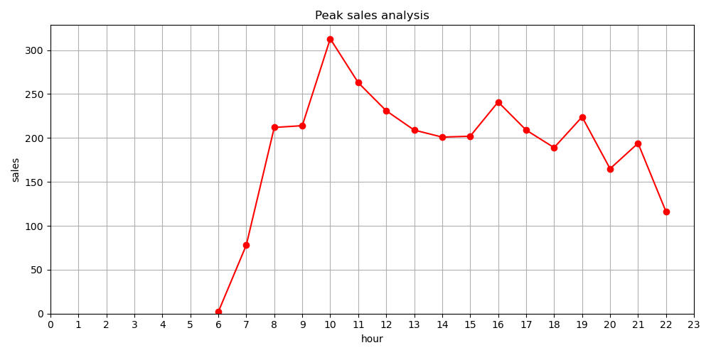

# Coffee Vending Machine Sales Analysis

## 📌 Project Overview
This project presents a comprehensive analysis of sales data from a coffee vending machine. The goal is to uncover actionable insights regarding **customer purchasing behavior, sales performance, payment preferences**, and **product popularity**.  
The findings are intended to support data-driven decision-making and optimize the vending machine's operational efficiency and profitability.

## 📂 Dataset
- **Source:** [Kaggle - Coffee Sales Dataset](https://www.kaggle.com/datasets/ihelon/coffee-sales/data)
- **Description:** Includes transactional data such as **date, product sold, payment type, card ID, transaction amount**, and **time of purchase**.

## 🔍 Key Insights
- 💳 **Preferred Payment Method:** Card payments dominate over cash transactions.
- ☕ **Top-Selling Beverages:** **Latte** and **Americano with Milk** lead as the most popular items.
- 🕒 **Peak Sales Hours:** Morning hours, particularly between **9 AM and 11 AM**, record the highest transaction volume.
- 📅 **Sales Distribution:** Sales are stronger on weekdays, with distinct patterns observed across different months.
- 🎯 **Customer Retention:** A small subset of loyal customers is responsible for a significant proportion of repeat purchases.

## 📊 Visual Highlights
Selected visualizations from the analysis:
1. **📈 Daily Sales Trend**  
   
2. **☕ Best-Selling Products**  
   
3. **⏰ Peak Sales Hours**  
   

## 🎯 Next Steps / Recommendations
- Consider offering promotions during non-peak hours to balance the sales load.
- Analyze customer cards further to identify demographics behind loyal customers.
- Monitor the least popular products to assess if they should be replaced or promoted differently.

## 🛠️ Tools and Technologies
- **Programming:** Python 🐍
- **Libraries:** Pandas, Matplotlib, Seaborn
- **Environment:** Jupyter Notebook

## ⚙️ Installation
To replicate this project, install the dependencies by running:
```bash
git clone https://github.com/AdemCE-eng/CoffeeSales.git
cd CoffeeSales
pip install -r requirements.txt
```
## 📘 Notebook
You can view the full Jupyter Notebook [here](Coffee_Sales_Analysis.ipynb) for detailed code, visualizations, and analysis.

## 🔮 Future Work
This project focused on data cleaning, exploratory data analysis (EDA), and generating actionable business insights.  
In future iterations, I plan to:

- Explore machine learning models to forecast future sales trends.
- Apply clustering techniques to segment customers based on behavior and purchase history.

## 📝 License
This project is licensed under the MIT License - see the [LICENSE](LICENSE) file for more details.
